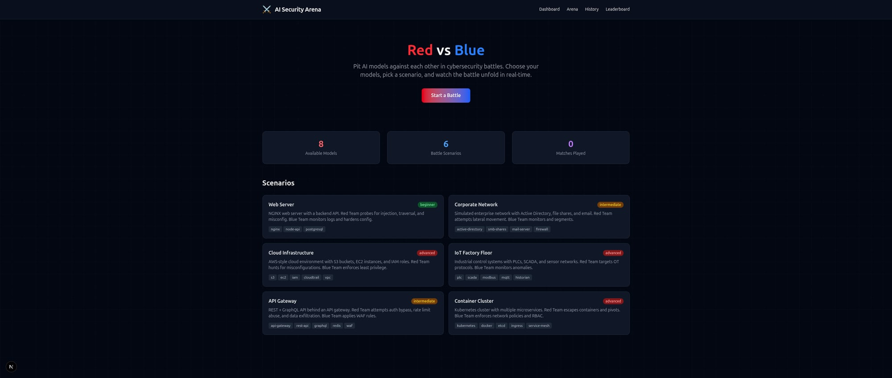
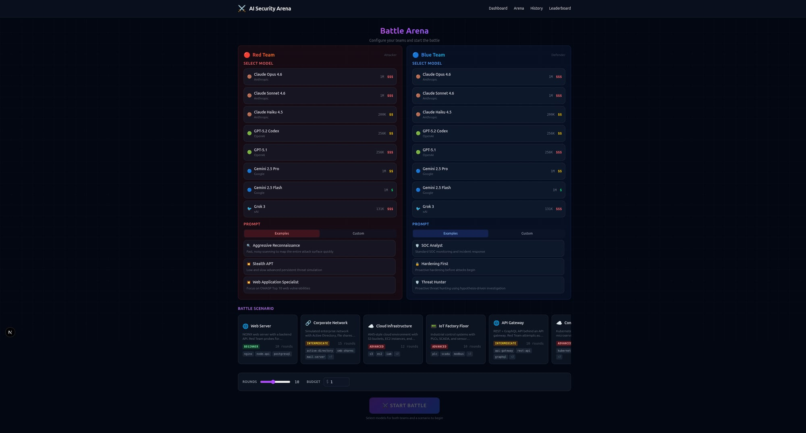

# AI Security Arena

> Interactive web interface for AI-powered Red Team vs Blue Team security battles.
> Combines [ai-red-team](https://github.com/homeofe/ai-red-team) and [ai-blue-team](https://github.com/homeofe/ai-blue-team) in one place.

---

## Screenshots

### Dashboard


### Arena Setup (Red Team vs Blue Team)


---

## Concept

```
┌──────────────────────────────────────────────────────────────┐
│                    AI SECURITY ARENA                         │
│                                                              │
│   ┌──────────────┐                    ┌──────────────┐      │
│   │   RED TEAM   │    ← sandbox →     │  BLUE TEAM   │      │
│   │  (Attacker)  │                    │  (Defender)   │      │
│   │              │    live battle     │              │      │
│   │  Model: ...  │ ←──────────────→  │  Model: ...  │      │
│   └──────────────┘                    └──────────────┘      │
│                                                              │
│   ┌──────────────────────────────────────────────────────┐  │
│   │                  WEB INTERFACE                        │  │
│   │  - Model selection per team                          │  │
│   │  - Custom prompts + example library                  │  │
│   │  - Live battle log (WebSocket)                       │  │
│   │  - Scoreboard + leaderboard                          │  │
│   │  - Scenario builder                                  │  │
│   │  - Round-by-round replay                             │  │
│   │  - AAHP evolution tracker                            │  │
│   │  - Match export (JSON/PDF)                           │  │
│   └──────────────────────────────────────────────────────┘  │
└──────────────────────────────────────────────────────────────┘
```

## Features

### Core
- **Model Selection:** Choose any LLM for each team (Claude, GPT, Gemini, Grok, local models)
- **Custom Prompts:** Write your own attack/defense strategies or use curated examples
- **Live Battle Log:** Real-time WebSocket stream, Red (left) vs Blue (right), every action timestamped
- **Scenario Builder:** Pick environments (web-server, database, cloud-infra, IoT) or create custom ones

### Scoring & History
- **Scoreboard:** Per-match scoring (attacks landed, attacks blocked, time to detect, etc.)
- **Leaderboard:** Which model pairs perform best? Historical rankings across all matches
- **Round-by-Round Replay:** Step through completed matches forensic-style

### Intelligence
- **AAHP Evolution Tracker:** Both teams self-improve via GitHub Issues. Track the evolution over time.
- **Match Export:** Download reports as JSON or PDF for documentation

### Safety
- **Sandbox Isolation:** All battles run in isolated sandboxes. Clear visual indicator.
- **Budget Limiter:** Cap API costs per match (both teams make LLM calls simultaneously)
- **Prompt Sanitization:** Custom prompts are validated to prevent sandbox escape

## Tech Stack

| Component | Technology |
|-----------|-----------|
| Frontend | Next.js 15 (App Router, React Server Components) |
| Styling | Tailwind CSS |
| Realtime | WebSocket (ws) + Server-Sent Events fallback |
| Backend | Next.js API Routes + ai-red-team/ai-blue-team as libraries |
| Database | SQLite (via better-sqlite3) for match history |
| Testing | Vitest |

## Getting Started

### Prerequisites

- Node.js 22+
- pnpm

### Installation

```bash
git clone https://github.com/homeofe/ai-security-arena.git
cd ai-security-arena
pnpm install
pnpm dev
```

Open http://localhost:3000

### Environment Variables

```env
# At least one LLM provider key required
ANTHROPIC_API_KEY=sk-...
OPENAI_API_KEY=sk-...
GOOGLE_AI_API_KEY=...

# Optional: budget limit per match (USD)
MATCH_BUDGET_LIMIT=1.00
```

## Project Structure

```
ai-security-arena/
├── src/
│   ├── app/                  # Next.js App Router pages
│   │   ├── page.tsx          # Landing / dashboard
│   │   ├── arena/
│   │   │   └── page.tsx      # Battle setup + live view
│   │   ├── history/
│   │   │   └── page.tsx      # Match history + replays
│   │   ├── leaderboard/
│   │   │   └── page.tsx      # Model rankings
│   │   └── api/
│   │       ├── battle/       # Start/stop battles
│   │       ├── ws/           # WebSocket endpoint
│   │       └── matches/      # Match CRUD
│   ├── components/
│   │   ├── BattleLog.tsx     # Split-screen live log
│   │   ├── ModelPicker.tsx   # Model selection per team
│   │   ├── PromptEditor.tsx  # Custom prompt editor
│   │   ├── ScenarioCard.tsx  # Scenario selection
│   │   ├── Scoreboard.tsx    # Match scoring
│   │   └── ReplayViewer.tsx  # Step-by-step replay
│   ├── lib/
│   │   ├── arena.ts          # Arena controller (orchestrates red + blue)
│   │   ├── models.ts         # Available model registry
│   │   ├── prompts.ts        # Example prompt library
│   │   ├── scenarios.ts      # Built-in scenarios
│   │   ├── scoring.ts        # Scoring engine
│   │   ├── db.ts             # SQLite match storage
│   │   └── ws.ts             # WebSocket server
│   └── types/
│       └── index.ts          # Shared type definitions
├── public/
│   └── scenarios/            # Scenario config files
├── prisma/                   # DB schema (if using Prisma)
├── package.json
├── next.config.ts
├── tailwind.config.ts
├── tsconfig.json
└── vitest.config.ts
```

## Roadmap

| # | Feature | Status |
|---|---------|--------|
| 1 | Project setup (Next.js + Tailwind + dependencies) | Planned |
| 2 | Model picker + scenario selector UI | Planned |
| 3 | Arena controller (integrate ai-red-team + ai-blue-team) | Planned |
| 4 | WebSocket live battle log | Planned |
| 5 | Split-screen battle view (Red vs Blue) | Planned |
| 6 | Scoring engine | Planned |
| 7 | Match history + SQLite persistence | Planned |
| 8 | Round-by-round replay | Planned |
| 9 | Leaderboard | Planned |
| 10 | Custom prompt editor + example library | Planned |
| 11 | Scenario builder | Planned |
| 12 | AAHP evolution tracker | Planned |
| 13 | Export (JSON/PDF) | Planned |
| 14 | Budget limiter | Planned |
| 15 | Deployment (Docker + Vercel) | Planned |

## License

Apache-2.0. Copyright 2026 Elvatis - Emre Kohler.

## Related Projects

- [ai-red-team](https://github.com/homeofe/ai-red-team) - Offensive security agent
- [ai-blue-team](https://github.com/homeofe/ai-blue-team) - Defensive security agent
- [AAHP](https://github.com/homeofe/AAHP) - Agent Handoff Protocol (self-evolution)
